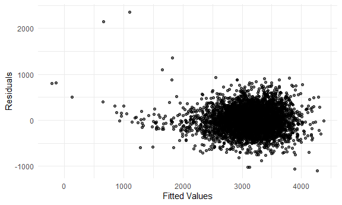
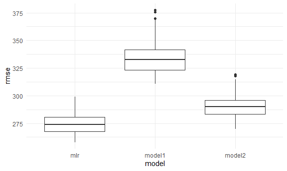
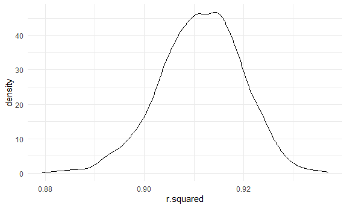
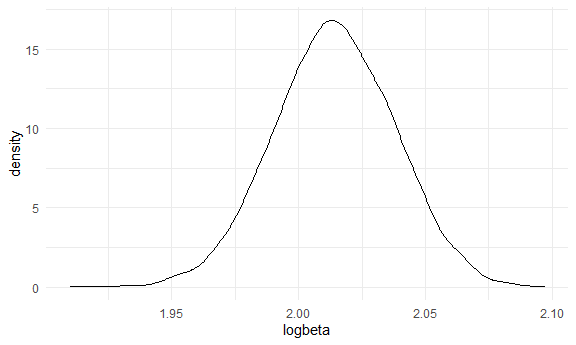

hw6
================
Baode Gao

# Problem 1

### Read and clean data

``` r
bw_df = 
  read.csv("data/birthweight.csv") %>% 
  janitor::clean_names() %>% 
  drop_na() %>% 
  mutate(
    babysex = factor(babysex),
    frace = factor(frace),
    mrace = factor(mrace),
    malform = factor(malform)
  ) 

knitr::kable(head(bw_df))
```

| babysex | bhead | blength |  bwt | delwt | fincome | frace | gaweeks | malform | menarche | mheight | momage | mrace | parity | pnumlbw | pnumsga |    ppbmi | ppwt | smoken | wtgain |
|:--------|------:|--------:|-----:|------:|--------:|:------|--------:|:--------|---------:|--------:|-------:|:------|-------:|--------:|--------:|---------:|-----:|-------:|-------:|
| 2       |    34 |      51 | 3629 |   177 |      35 | 1     |    39.9 | 0       |       13 |      63 |     36 | 1     |      3 |       0 |       0 | 26.27184 |  148 |      0 |     29 |
| 1       |    34 |      48 | 3062 |   156 |      65 | 2     |    25.9 | 0       |       14 |      65 |     25 | 2     |      0 |       0 |       0 | 21.34485 |  128 |      0 |     28 |
| 2       |    36 |      50 | 3345 |   148 |      85 | 1     |    39.9 | 0       |       12 |      64 |     29 | 1     |      0 |       0 |       0 | 23.56517 |  137 |      1 |     11 |
| 1       |    34 |      52 | 3062 |   157 |      55 | 1     |    40.0 | 0       |       14 |      64 |     18 | 1     |      0 |       0 |       0 | 21.84508 |  127 |     10 |     30 |
| 2       |    34 |      52 | 3374 |   156 |       5 | 1     |    41.6 | 0       |       13 |      66 |     20 | 1     |      0 |       0 |       0 | 21.02642 |  130 |      1 |     26 |
| 1       |    33 |      52 | 3374 |   129 |      55 | 1     |    40.7 | 0       |       12 |      66 |     23 | 1     |      0 |       0 |       0 | 18.60030 |  115 |      0 |     14 |

### Modeling and residuals plot

``` r
bw_df = dummy_cols(bw_df, select_columns = c('babysex', 'frace', 'malform', 'mrace'))
mlr = lm(bwt ~ ., data = bw_df) %>% 
  step(direction = 'both')
```

The model was selected by stepwise regression. In each step, a variable
was added and a variable was removed, if the AIC would decrease.

``` r
bw_df %>% 
  add_residuals(mlr) %>% 
  add_predictions(mlr) %>% 
  ggplot(aes(x = pred, y = resid)) +
  geom_point(alpha = 0.6) +
  xlab("Fitted Values") +
  ylab("Residuals")
```



As shown in the plot, residual values bounced around 0 and they were
basically symmetrical.

### Compare to two others

``` r
model1 = lm(bwt ~ blength + gaweeks, data = bw_df)
summary(model1)
```

    ## 
    ## Call:
    ## lm(formula = bwt ~ blength + gaweeks, data = bw_df)
    ## 
    ## Residuals:
    ##     Min      1Q  Median      3Q     Max 
    ## -1709.6  -215.4   -11.4   208.2  4188.8 
    ## 
    ## Coefficients:
    ##              Estimate Std. Error t value Pr(>|t|)    
    ## (Intercept) -4347.667     97.958  -44.38   <2e-16 ***
    ## blength       128.556      1.990   64.60   <2e-16 ***
    ## gaweeks        27.047      1.718   15.74   <2e-16 ***
    ## ---
    ## Signif. codes:  0 '***' 0.001 '**' 0.01 '*' 0.05 '.' 0.1 ' ' 1
    ## 
    ## Residual standard error: 333.2 on 4339 degrees of freedom
    ## Multiple R-squared:  0.5769, Adjusted R-squared:  0.5767 
    ## F-statistic:  2958 on 2 and 4339 DF,  p-value: < 2.2e-16

``` r
model2 = lm(bwt ~ bhead * blength * babysex, data = bw_df)
summary(model2)
```

    ## 
    ## Call:
    ## lm(formula = bwt ~ bhead * blength * babysex, data = bw_df)
    ## 
    ## Residuals:
    ##      Min       1Q   Median       3Q      Max 
    ## -1132.99  -190.42   -10.33   178.63  2617.96 
    ## 
    ## Coefficients:
    ##                          Estimate Std. Error t value Pr(>|t|)    
    ## (Intercept)            -7176.8170  1264.8397  -5.674 1.49e-08 ***
    ## bhead                    181.7956    38.0542   4.777 1.84e-06 ***
    ## blength                  102.1269    26.2118   3.896 9.92e-05 ***
    ## babysex2                6374.8684  1677.7669   3.800 0.000147 ***
    ## bhead:blength             -0.5536     0.7802  -0.710 0.478012    
    ## bhead:babysex2          -198.3932    51.0917  -3.883 0.000105 ***
    ## blength:babysex2        -123.7729    35.1185  -3.524 0.000429 ***
    ## bhead:blength:babysex2     3.8781     1.0566   3.670 0.000245 ***
    ## ---
    ## Signif. codes:  0 '***' 0.001 '**' 0.01 '*' 0.05 '.' 0.1 ' ' 1
    ## 
    ## Residual standard error: 287.7 on 4334 degrees of freedom
    ## Multiple R-squared:  0.6849, Adjusted R-squared:  0.6844 
    ## F-statistic:  1346 on 7 and 4334 DF,  p-value: < 2.2e-16

``` r
cv_df = 
  crossv_mc(bw_df, 100) %>% 
  mutate(
    train = map(train, as_tibble),
    test = map(test, as_tibble)
  ) %>% 
  mutate(
    mlr = map(train, ~lm(bwt ~ babysex_1 + bhead + blength + delwt + fincome +
                           gaweeks + mheight + mrace_1 + mrace_2 + mrace_3 +
                           parity + ppwt + smoken, data = .x)),
    model1 = map(train, ~lm(bwt ~ blength + gaweeks, data = .x)),
    model2 = map(train, ~lm(bwt ~ bhead * blength * babysex, data = .x))) %>% 
  mutate(
    rmse_mlr = map2_dbl(mlr, test, ~rmse(model = .x, data = .y)),
    rmse_model1 = map2_dbl(model1, test, ~rmse(model = .x, data = .y)),
    rmse_model2 = map2_dbl(model2, test, ~rmse(model = .x, data = .y)))

cv_df %>% 
  select(starts_with('rmse')) %>% 
  pivot_longer(
    rmse_mlr:rmse_model2,
    names_to = 'model',
    values_to = 'rmse', 
    names_prefix = 'rmse_'
  ) %>% 
  ggplot(aes(x = model, y = rmse)) +
  geom_boxplot()
```



As shown in the box plots, mlr had the lowest rmse and model1 had the
highest rmse.

# Problem 2

### bootstrapping

``` r
slm = lm(tmax ~ tmin, data = weather_df)

slm_df = 
  slm %>% 
  broom::tidy()
logbeta = log(pull(filter(slm_df, term == '(Intercept)'), estimate) * pull(filter(slm_df, term == 'tmin'), estimate))
R2 = slm %>% 
    broom::glance() %>% 
    pull(r.squared)

weather_sp = weather_df %>% 
  modelr::bootstrap(n = 5000) %>% 
  mutate(
    models = map(strap, ~ lm(tmax ~ tmin, data = .x)),
    estimates = map(models, broom::tidy),
    glance = map(models, broom::glance)) %>% 
    unnest(glance, estimates) %>% 
    select(.id, term, estimate, r.squared) %>% 

    mutate(term = ifelse(term == '(Intercept)', 'beta0', 'beta1')) %>% 
    pivot_wider(names_from = term, 
                values_from = estimate) %>% 
    mutate(
      logbeta = log(beta0 * beta1)
    )
```

    ## Warning: unnest() has a new interface. See ?unnest for details.
    ## Try `df %>% unnest(c(glance, estimates))`, with `mutate()` if needed

# Get info

``` r
weather_sp %>% 
  ggplot(aes(x = r.squared)) + 
  geom_density()
```



``` r
weather_sp %>% 
  ggplot(aes(x = logbeta)) + 
  geom_density() 
```



``` r
quantile(pull(weather_sp,r.squared), c(0.025, 0.975))
```

    ##      2.5%     97.5% 
    ## 0.8935713 0.9266177

``` r
quantile(pull(weather_sp,logbeta), c(0.025, 0.975))
```

    ##     2.5%    97.5% 
    ## 1.966433 2.060433

Both *r*<sup>2</sup> and logbeta are basically normally distributed.The
mean of *r*<sup>2</sup> is around 0.913 and the expectation of logbeta
is around 2.015.
